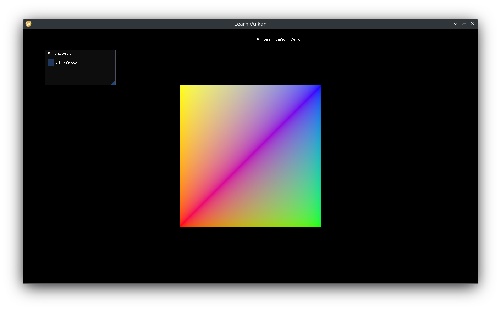

# Shader Buffer

Uniform and Storage buffers need to be N-buffered unless they are "GPU const", ie contents do not change after creation.  Encapsulate a `vma::Buffer` per virtual frame in a `ShaderBuffer`:

```cpp
class ShaderBuffer {
 public:
  explicit ShaderBuffer(VmaAllocator allocator, std::uint32_t queue_family,
              vk::BufferUsageFlags usage);

  void write_at(std::size_t frame_index, std::span<std::byte const> bytes);

  [[nodiscard]] auto descriptor_info_at(std::size_t frame_index) const
    -> vk::DescriptorBufferInfo;

 private:
  struct Buffer {
    vma::Buffer buffer{};
    vk::DeviceSize size{};
  };

  void write_to(Buffer& out, std::span<std::byte const> bytes) const;

  VmaAllocator m_allocator{};
  std::uint32_t m_queue_family{};
  vk::BufferUsageFlags m_usage{};
  Buffered<Buffer> m_buffers{};
};
```

The implementation is fairly straightforward, it reuses existing buffers if they are large enough, else recreates them before copying data. It also ensures buffers are always valid to be bound to descriptors.

```cpp
ShaderBuffer::ShaderBuffer(VmaAllocator allocator,
                           std::uint32_t const queue_family,
                           vk::BufferUsageFlags const usage)
  : m_allocator(allocator), m_queue_family(queue_family), m_usage(usage) {
  // ensure buffers are created and can be bound after returning.
  for (auto& buffer : m_buffers) { write_to(buffer, {}); }
}

void ShaderBuffer::write_at(std::size_t const frame_index,
                            std::span<std::byte const> bytes) {
  write_to(m_buffers.at(frame_index), bytes);
}

auto ShaderBuffer::descriptor_info_at(std::size_t const frame_index) const
  -> vk::DescriptorBufferInfo {
  auto const& buffer = m_buffers.at(frame_index);
  auto ret = vk::DescriptorBufferInfo{};
  ret.setBuffer(buffer.buffer.get().buffer).setRange(buffer.size);
  return ret;
}

void ShaderBuffer::write_to(Buffer& out,
                            std::span<std::byte const> bytes) const {
  static constexpr auto blank_byte_v = std::array{std::byte{}};
  // fallback to an empty byte if bytes is empty.
  if (bytes.empty()) { bytes = blank_byte_v; }
  out.size = bytes.size();
  if (out.buffer.get().size < bytes.size()) {
    // size is too small (or buffer doesn't exist yet), recreate buffer.
    auto const buffer_ci = vma::BufferCreateInfo{
      .allocator = m_allocator,
      .usage = m_usage,
      .queue_family = m_queue_family,
    };
    out.buffer = vma::create_buffer(buffer_ci, vma::BufferMemoryType::Host,
                    out.size);
  }
  std::memcpy(out.buffer.get().mapped, bytes.data(), bytes.size());
}
```

Store a `ShaderBuffer` in `App` and rename `create_vertex_buffer()` to `create_shader_resources()`:

```cpp
std::optional<ShaderBuffer> m_view_ubo{};

// ...
m_vbo = vma::create_device_buffer(buffer_ci, create_command_block(),
                                  total_bytes_v);

m_view_ubo.emplace(m_allocator.get(), m_gpu.queue_family,
              vk::BufferUsageFlagBits::eUniformBuffer);
```

Add functions to update the view/projection matrices and bind the frame's descriptor sets:

```cpp
void App::update_view() {
  auto const half_size = 0.5f * glm::vec2{m_framebuffer_size};
  auto const mat_projection =
    glm::ortho(-half_size.x, half_size.x, -half_size.y, half_size.y);
  auto const bytes =
    std::bit_cast<std::array<std::byte, sizeof(mat_projection)>>(
      mat_projection);
  m_view_ubo->write_at(m_frame_index, bytes);
}

// ...
void App::bind_descriptor_sets(vk::CommandBuffer const command_buffer) const {
  auto writes = std::array<vk::WriteDescriptorSet, 1>{};
  auto const& descriptor_sets = m_descriptor_sets.at(m_frame_index);
  auto const set0 = descriptor_sets[0];
  auto write = vk::WriteDescriptorSet{};
  auto const view_ubo_info = m_view_ubo->descriptor_info_at(m_frame_index);
  write.setBufferInfo(view_ubo_info)
    .setDescriptorType(vk::DescriptorType::eUniformBuffer)
    .setDescriptorCount(1)
    .setDstSet(set0)
    .setDstBinding(0);
  writes[0] = write;
  m_device->updateDescriptorSets(writes, {});

  command_buffer.bindDescriptorSets(vk::PipelineBindPoint::eGraphics,
                                    *m_pipeline_layout, 0, descriptor_sets,
                                    {});
}
```

Add the descriptor set layouts to the Shader, call `update_view()` before `draw()`, and `bind_descriptor_sets()` in `draw()`:

```cpp
auto const shader_ci = ShaderProgram::CreateInfo{
  .device = *m_device,
  .vertex_spirv = vertex_spirv,
  .fragment_spirv = fragment_spirv,
  .vertex_input = vertex_input_v,
  .set_layouts = m_set_layout_views,
};

// ...
inspect();
update_view();
draw(command_buffer);

// ...
m_shader->bind(command_buffer, m_framebuffer_size);
bind_descriptor_sets(command_buffer);
// ...
```

Update the vertex shader to use the view UBO:

```glsl
layout (set = 0, binding = 0) uniform View {
  mat4 mat_vp;
};

// ...
void main() {
  const vec4 world_pos = vec4(a_pos, 0.0, 1.0);

  out_color = a_color;
  gl_Position = mat_vp * world_pos;
}
```

Since the projected space is now the framebuffer size instead of [-1, 1], update the vertex positions to be larger than 1 pixel:

```cpp
static constexpr auto vertices_v = std::array{
  Vertex{.position = {-200.0f, -200.0f}, .color = {1.0f, 0.0f, 0.0f}},
  Vertex{.position = {200.0f, -200.0f}, .color = {0.0f, 1.0f, 0.0f}},
  Vertex{.position = {200.0f, 200.0f}, .color = {0.0f, 0.0f, 1.0f}},
  Vertex{.position = {-200.0f, 200.0f}, .color = {1.0f, 1.0f, 0.0f}},
};
```



When such shader buffers are created and (more importantly) destroyed dynamically, they would need to store a `ScopedWaiter` to ensure all rendering with descriptor sets bound to them completes before destruction. Alternatively, the app can maintain a pool of scratch buffers (similar to small/dynamic vertex buffers) per virtual frame which get destroyed in a batch instead of individually.
