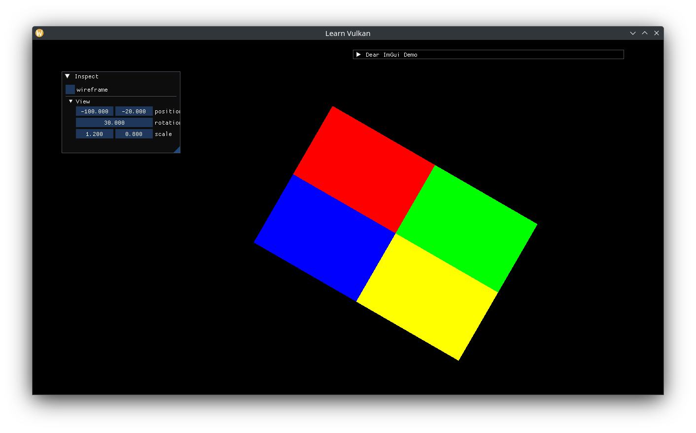

# View Matrix

Integrating the view matrix will be quite simple and short. First, transformations for objects and cameras/views can be encapsulated into a single struct:

```cpp
struct Transform {
  glm::vec2 position{};
  float rotation{};
  glm::vec2 scale{1.0f};

  [[nodiscard]] auto model_matrix() const -> glm::mat4;
  [[nodiscard]] auto view_matrix() const -> glm::mat4;
};
```

Extracting the common logic into a helper, both member functions can be implemented easily:

```cpp
namespace {
struct Matrices {
  glm::mat4 translation;
  glm::mat4 orientation;
  glm::mat4 scale;
};

[[nodiscard]] auto to_matrices(glm::vec2 const position, float rotation,
                 glm::vec2 const scale) -> Matrices {
  static constexpr auto mat_v = glm::identity<glm::mat4>();
  static constexpr auto axis_v = glm::vec3{0.0f, 0.0f, 1.0f};
  return Matrices{
    .translation = glm::translate(mat_v, glm::vec3{position, 0.0f}),
    .orientation = glm::rotate(mat_v, glm::radians(rotation), axis_v),
    .scale = glm::scale(mat_v, glm::vec3{scale, 1.0f}),
  };
}
} // namespace

auto Transform::model_matrix() const -> glm::mat4 {
  auto const [t, r, s] = to_matrices(position, rotation, scale);
  // right to left: scale first, then rotate, then translate.
  return t * r * s;
}

auto Transform::view_matrix() const -> glm::mat4 {
  // view matrix is the inverse of the model matrix.
  // instead, perform translation and rotation in reverse order and with
  // negative values. or, use glm::lookAt().
  //  scale is kept unchanged as the first transformation for
  // "intuitive" scaling on cameras.
  auto const [t, r, s] = to_matrices(-position, -rotation, scale);
  return r * t * s;
}
```

Add a `Transform` member to `App` to represent the view/camera, inspect its members, and combine with the existing projection matrix:

```cpp
Transform m_view_transform{};

// ...
ImGui::Separator();
if (ImGui::TreeNode("View")) {
  ImGui::DragFloat2("position", &m_view_transform.position.x);
  ImGui::DragFloat("rotation", &m_view_transform.rotation);
  ImGui::DragFloat2("scale", &m_view_transform.scale.x);
  ImGui::TreePop();
}

// ...
auto const mat_view = m_view_transform.view_matrix();
auto const mat_vp = mat_projection * mat_view;
auto const bytes =
  std::bit_cast<std::array<std::byte, sizeof(mat_vp)>>(mat_vp);
m_view_ubo->write_at(m_frame_index, bytes);
```

Naturally, moving the view left moves everything else - currently only a single RGBY quad - to the _right_.


