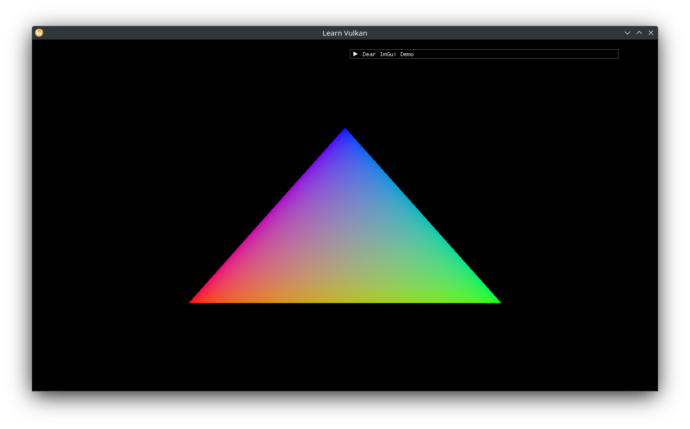

# Pipeline Creation

To constrain ourselves to a subset of pipeline state to worry about, create a custom `struct PipelineState`:

```cpp
// bit flags for various binary Pipeline States.
struct PipelineFlag {
  enum : std::uint8_t {
    None = 0,
    AlphaBlend = 1 << 0, // turn on alpha blending.
    DepthTest = 1 << 1,	 // turn on depth write and test.
  };
};

// specification of a unique Graphics Pipeline.
struct PipelineState {
  using Flag = PipelineFlag;

  [[nodiscard]] static constexpr auto default_flags() -> std::uint8_t {
    return Flag::AlphaBlend | Flag::DepthTest;
  }

  vk::ShaderModule vertex_shader;	  // required.
  vk::ShaderModule fragment_shader; // required.

  std::span<vk::VertexInputAttributeDescription const> vertex_attributes{};
  std::span<vk::VertexInputBindingDescription const> vertex_bindings{};

  vk::PrimitiveTopology topology{vk::PrimitiveTopology::eTriangleList};
  vk::PolygonMode polygon_mode{vk::PolygonMode::eFill};
  vk::CullModeFlags cull_mode{vk::CullModeFlagBits::eNone};
  vk::CompareOp depth_compare{vk::CompareOp::eLess};
  std::uint8_t flags{default_flags()};
};
```

Encapsulate the exhausting process of building a pipeline into its own class:

```cpp
struct PipelineBuilderCreateInfo {
  vk::Device device{};
  vk::SampleCountFlagBits samples{};
  vk::Format color_format{};
  vk::Format depth_format{};
};

class PipelineBuilder {
  public:
  using CreateInfo = PipelineBuilderCreateInfo;

  explicit PipelineBuilder(CreateInfo const& create_info);

  [[nodiscard]] auto build(vk::PipelineLayout layout,
               PipelineState const& state) const
    -> vk::UniquePipeline;

  private:
  CreateInfo m_info{};
};
```

Implement `build()`:

```cpp
auto PipelineBuilder::build(vk::PipelineLayout const layout,
              PipelineState const& state) const
  -> vk::UniquePipeline {
  // set vertex (0) and fragment (1) shader stages.
  auto shader_stages = std::array<vk::PipelineShaderStageCreateInfo, 2>{};
  shader_stages[0]
    .setStage(vk::ShaderStageFlagBits::eVertex)
    .setPName("main")
    .setModule(state.vertex_shader);
  shader_stages[1]
    .setStage(vk::ShaderStageFlagBits::eFragment)
    .setPName("main")
    .setModule(state.fragment_shader);

  auto pvisci = vk::PipelineVertexInputStateCreateInfo{};
  pvisci.setVertexAttributeDescriptions(state.vertex_attributes)
      .setVertexBindingDescriptions(state.vertex_bindings);

  auto prsci = vk::PipelineRasterizationStateCreateInfo{};
  prsci.setPolygonMode(state.polygon_mode).setCullMode(state.cull_mode);

  auto pdssci = vk::PipelineDepthStencilStateCreateInfo{};
  auto const depth_test =
    (state.flags & PipelineFlag::DepthTest) == PipelineFlag::DepthTest;
  pdssci.setDepthTestEnable(depth_test ? vk::True : vk::False)
    .setDepthCompareOp(state.depth_compare);

  auto const piasci =
    vk::PipelineInputAssemblyStateCreateInfo{{}, state.topology};

  auto pcbas = vk::PipelineColorBlendAttachmentState{};
  auto const alpha_blend =
    (state.flags & PipelineFlag::AlphaBlend) == PipelineFlag::AlphaBlend;
  using CCF = vk::ColorComponentFlagBits;
  pcbas.setColorWriteMask(CCF::eR | CCF::eG | CCF::eB | CCF::eA)
    .setBlendEnable(alpha_blend ? vk::True : vk::False)
    .setSrcColorBlendFactor(vk::BlendFactor::eSrcAlpha)
    .setDstColorBlendFactor(vk::BlendFactor::eOneMinusSrcAlpha)
    .setColorBlendOp(vk::BlendOp::eAdd)
    .setSrcAlphaBlendFactor(vk::BlendFactor::eOne)
    .setDstAlphaBlendFactor(vk::BlendFactor::eZero)
    .setAlphaBlendOp(vk::BlendOp::eAdd);
  auto pcbsci = vk::PipelineColorBlendStateCreateInfo{};
  pcbsci.setAttachments(pcbas);

  // these dynamic states are guaranteed to be available.
  auto const pdscis = std::array{
    vk::DynamicState::eViewport,
    vk::DynamicState::eScissor,
    vk::DynamicState::eLineWidth,
  };
  auto pdsci = vk::PipelineDynamicStateCreateInfo{};
  pdsci.setDynamicStates(pdscis);

  // single viewport and scissor.
  auto const pvsci = vk::PipelineViewportStateCreateInfo({}, 1, {}, 1);

  auto pmsci = vk::PipelineMultisampleStateCreateInfo{};
  pmsci.setRasterizationSamples(m_info.samples)
    .setSampleShadingEnable(vk::False);

  auto prci = vk::PipelineRenderingCreateInfo{};
  // could be a depth-only pass.
  if (m_info.color_format != vk::Format::eUndefined) {
    prci.setColorAttachmentFormats(m_info.color_format);
  }
  prci.setDepthAttachmentFormat(m_info.depth_format);

  auto gpci = vk::GraphicsPipelineCreateInfo{};
  gpci.setStages(shader_stages)
    .setPRasterizationState(&prsci)
    .setPDepthStencilState(&pdssci)
    .setPInputAssemblyState(&piasci)
    .setPColorBlendState(&pcbsci)
    .setPDynamicState(&pdsci)
    .setPViewportState(&pvsci)
    .setPMultisampleState(&pmsci)
    .setLayout(layout)
    .setPNext(&prci);

  auto ret = vk::Pipeline{};
  // use non-throwing API.
  if (m_info.device.createGraphicsPipelines({}, 1, &gpci, {}, &ret) !=
    vk::Result::eSuccess) {
    return {};
  }

  return vk::UniquePipeline{ret, m_info.device};
}
```

Add new `App` members:

```cpp
void create_pipeline_builder();
void create_pipeline();

// ...
std::optional<PipelineBuilder> m_pipeline_builder{};

vk::UniquePipelineLayout m_pipeline_layout{};
vk::UniquePipeline m_pipeline{};
```

Implement and call `create_pipeline_builder()`:

```cpp
void App::create_pipeline_builder() {
  auto const pipeline_builder_ci = PipelineBuilder::CreateInfo{
    .device = *m_device,
    .samples = vk::SampleCountFlagBits::e1,
    .color_format = m_swapchain->get_format(),
  };
  m_pipeline_builder.emplace(pipeline_builder_ci);
}
```

Complete the implementation of `create_pipeline()`:

```cpp
// ...
m_pipeline_layout = m_device->createPipelineLayoutUnique({});

auto const pipeline_state = PipelineState{
  .vertex_shader = *vertex,
  .fragment_shader = *fragment,
};
m_pipeline = m_pipeline_builder->build(*m_pipeline_layout, pipeline_state);
if (!m_pipeline) {
  throw std::runtime_error{"Failed to create Graphics Pipeline"};
}
```

We can now bind it and use it to draw the triangle in the shader. Since we used dynamic viewport and scissor during pipeline creation, we need to set those after binding the pipeline.

```cpp
command_buffer.beginRendering(rendering_info);
ImGui::ShowDemoWindow();

command_buffer.bindPipeline(vk::PipelineBindPoint::eGraphics, *m_pipeline);
auto viewport = vk::Viewport{};
// flip the viewport across the X-axis (negative height):
// https://www.saschawillems.de/blog/2019/03/29/flipping-the-vulkan-viewport/
viewport.setX(0.0f)
  .setY(static_cast<float>(m_render_target->extent.height))
  .setWidth(static_cast<float>(m_render_target->extent.width))
  .setHeight(-viewport.y);
command_buffer.setViewport(0, viewport);
command_buffer.setScissor(0, render_area);
// current shader has hard-coded logic for 3 vertices.
command_buffer.draw(3, 1, 0, 0);
```


Updating our shaders to use interpolated RGB on each vertex:

```glsl
// shader.vert

layout (location = 0) out vec3 out_color;

// ...
const vec3 colors[] = {
  vec3(1.0, 0.0, 0.0),
  vec3(0.0, 1.0, 0.0),
  vec3(0.0, 0.0, 1.0),
};

// ...
out_color = colors[gl_VertexIndex];

// shader.frag

layout (location = 0) in vec3 in_color;

// ...
out_color = vec4(in_color, 1.0);
```

And a black clear color:

```cpp
// ...
.setClearValue(vk::ClearColorValue{0.0f, 0.0f, 0.0f, 1.0f});
```

Gives us the renowned Vulkan sRGB triangle:


