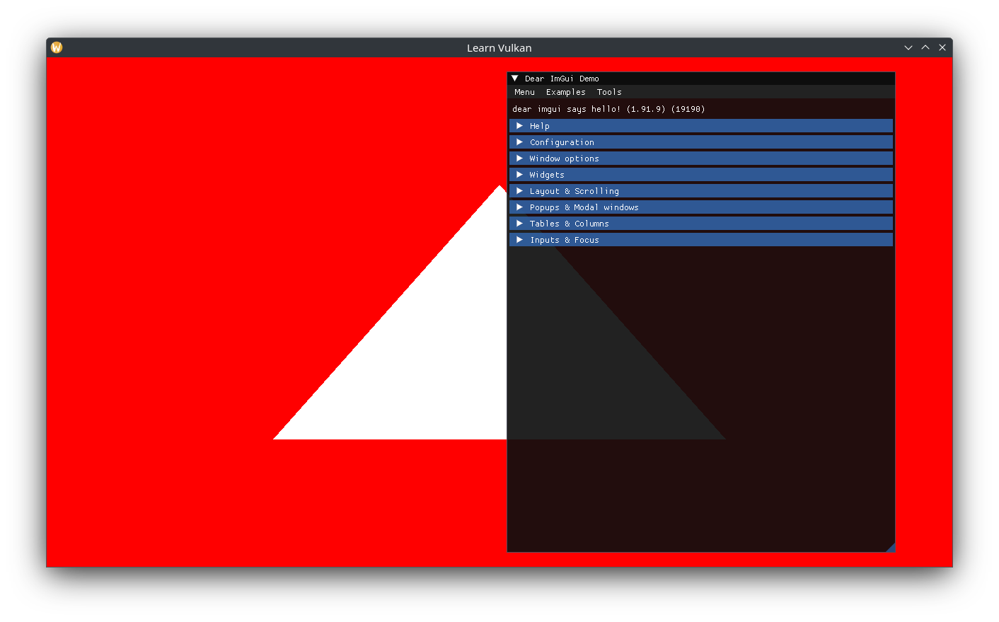

# Pipeline Creation

To constrain ourselves to a subset of pipeline state to worry about, create a custom `struct PipelineState`:

```cpp
// bit flags for various binary Pipeline States.
struct PipelineFlag {
  enum : std::uint8_t {
    None = 0,
    AlphaBlend = 1 << 0, // turn on alpha blending.
    DepthTest = 1 << 1,	 // turn on depth write and test.
  };
};

// specification of a unique Graphics Pipeline.
struct PipelineState {
  using Flag = PipelineFlag;

  [[nodiscard]] static constexpr auto default_flags() -> std::uint8_t {
    return Flag::AlphaBlend | Flag::DepthTest;
  }

  vk::ShaderModule vertex_shader;	  // required.
  vk::ShaderModule fragment_shader; // required.

  std::span<vk::VertexInputAttributeDescription const> vertex_attributes{};
  std::span<vk::VertexInputBindingDescription const> vertex_bindings{};

  vk::PrimitiveTopology topology{vk::PrimitiveTopology::eTriangleList};
  vk::PolygonMode polygon_mode{vk::PolygonMode::eFill};
  vk::CullModeFlags cull_mode{vk::CullModeFlagBits::eNone};
  vk::CompareOp depth_compare{vk::CompareOp::eLess};
  std::uint8_t flags{default_flags()};
};
```

Encapsulate the exhausting process of building a pipeline into its own class:

```cpp
struct PipelineBuilderCreateInfo {
  vk::Device device{};
  vk::SampleCountFlagBits samples{};
  vk::Format color_format{};
  vk::Format depth_format{};
};

class PipelineBuilder {
  public:
  using CreateInfo = PipelineBuilderCreateInfo;

  explicit PipelineBuilder(CreateInfo const& create_info);

  [[nodiscard]] auto build(vk::PipelineLayout layout,
               PipelineState const& state) const
    -> vk::UniquePipeline;

  private:
  CreateInfo m_info{};
};
```

Before implementing `build()`, add some helper functions/constants, starting with the viewport and dynamic states:

```cpp
// single viewport and scissor.
constexpr auto viewport_state_v =
  vk::PipelineViewportStateCreateInfo({}, 1, {}, 1);

// these dynamic states are guaranteed to be available.
constexpr auto dynamic_states_v = std::array{
  vk::DynamicState::eViewport,
  vk::DynamicState::eScissor,
  vk::DynamicState::eLineWidth,
};
```

The shader stages:

```cpp
[[nodiscard]] constexpr auto
create_shader_stages(vk::ShaderModule const vertex,
           vk::ShaderModule const fragment) {
  // set vertex (0) and fragment (1) shader stages.
  auto ret = std::array<vk::PipelineShaderStageCreateInfo, 2>{};
  ret[0]
    .setStage(vk::ShaderStageFlagBits::eVertex)
    .setPName("main")
    .setModule(vertex);
  ret[1]
    .setStage(vk::ShaderStageFlagBits::eFragment)
    .setPName("main")
    .setModule(fragment);
  return ret;
}
```

The depth/stencil state:

```cpp
[[nodiscard]] constexpr auto
create_depth_stencil_state(std::uint8_t flags,
               vk::CompareOp const depth_compare) {
  auto ret = vk::PipelineDepthStencilStateCreateInfo{};
  auto const depth_test =
    (flags & PipelineFlag::DepthTest) == PipelineFlag::DepthTest;
  ret.setDepthTestEnable(depth_test ? vk::True : vk::False)
    .setDepthCompareOp(depth_compare);
  return ret;
}
```

And a color blend attachment:

```cpp
[[nodiscard]] constexpr auto
create_color_blend_attachment(std::uint8_t const flags) {
  auto ret = vk::PipelineColorBlendAttachmentState{};
  auto const alpha_blend =
    (flags & PipelineFlag::AlphaBlend) == PipelineFlag::AlphaBlend;
  using CCF = vk::ColorComponentFlagBits;
  ret.setColorWriteMask(CCF::eR | CCF::eG | CCF::eB | CCF::eA)
    .setBlendEnable(alpha_blend ? vk::True : vk::False)
    // standard alpha blending:
    // (alpha * src) + (1 - alpha) * dst
    .setSrcColorBlendFactor(vk::BlendFactor::eSrcAlpha)
    .setDstColorBlendFactor(vk::BlendFactor::eOneMinusSrcAlpha)
    .setColorBlendOp(vk::BlendOp::eAdd)
    .setSrcAlphaBlendFactor(vk::BlendFactor::eOne)
    .setDstAlphaBlendFactor(vk::BlendFactor::eZero)
    .setAlphaBlendOp(vk::BlendOp::eAdd);
  return ret;
}
```

Now we can implement `build()`:

```cpp
auto PipelineBuilder::build(vk::PipelineLayout const layout,
              PipelineState const& state) const
  -> vk::UniquePipeline {
  auto const shader_stage_ci =
    create_shader_stages(state.vertex_shader, state.fragment_shader);

  auto vertex_input_ci = vk::PipelineVertexInputStateCreateInfo{};
  vertex_input_ci.setVertexAttributeDescriptions(state.vertex_attributes)
    .setVertexBindingDescriptions(state.vertex_bindings);

  auto multisample_state_ci = vk::PipelineMultisampleStateCreateInfo{};
  multisample_state_ci.setRasterizationSamples(m_info.samples)
    .setSampleShadingEnable(vk::False);

  auto const input_assembly_ci =
    vk::PipelineInputAssemblyStateCreateInfo{{}, state.topology};

  auto rasterization_state_ci = vk::PipelineRasterizationStateCreateInfo{};
  rasterization_state_ci.setPolygonMode(state.polygon_mode)
    .setCullMode(state.cull_mode);

  auto const depth_stencil_state_ci =
    create_depth_stencil_state(state.flags, state.depth_compare);

  auto const color_blend_attachment =
    create_color_blend_attachment(state.flags);
  auto color_blend_state_ci = vk::PipelineColorBlendStateCreateInfo{};
  color_blend_state_ci.setAttachments(color_blend_attachment);

  auto dynamic_state_ci = vk::PipelineDynamicStateCreateInfo{};
  dynamic_state_ci.setDynamicStates(dynamic_states_v);

  // Dynamic Rendering requires passing this in the pNext chain.
  auto rendering_ci = vk::PipelineRenderingCreateInfo{};
  // could be a depth-only pass, argument is span-like (notice the plural
  // `Formats()`), only set if not Undefined.
  if (m_info.color_format != vk::Format::eUndefined) {
    rendering_ci.setColorAttachmentFormats(m_info.color_format);
  }
  // single depth attachment format, ok to set to Undefined.
  rendering_ci.setDepthAttachmentFormat(m_info.depth_format);

  auto pipeline_ci = vk::GraphicsPipelineCreateInfo{};
  pipeline_ci.setLayout(layout)
    .setStages(shader_stage_ci)
    .setPVertexInputState(&vertex_input_ci)
    .setPViewportState(&viewport_state_v)
    .setPMultisampleState(&multisample_state_ci)
    .setPInputAssemblyState(&input_assembly_ci)
    .setPRasterizationState(&rasterization_state_ci)
    .setPDepthStencilState(&depth_stencil_state_ci)
    .setPColorBlendState(&color_blend_state_ci)
    .setPDynamicState(&dynamic_state_ci)
    .setPNext(&rendering_ci);

  auto ret = vk::Pipeline{};
  // use non-throwing API.
  if (m_info.device.createGraphicsPipelines({}, 1, &pipeline_ci, {}, &ret) !=
    vk::Result::eSuccess) {
    return {};
  }

  return vk::UniquePipeline{ret, m_info.device};
}
```

Add new `App` members:

```cpp
void create_pipeline_builder();
void create_pipeline();

// ...
std::optional<PipelineBuilder> m_pipeline_builder{};

vk::UniquePipelineLayout m_pipeline_layout{};
vk::UniquePipeline m_pipeline{};
```

Implement and call `create_pipeline_builder()`:

```cpp
void App::create_pipeline_builder() {
  auto const pipeline_builder_ci = PipelineBuilder::CreateInfo{
    .device = *m_device,
    .samples = vk::SampleCountFlagBits::e1,
    .color_format = m_swapchain->get_format(),
  };
  m_pipeline_builder.emplace(pipeline_builder_ci);
}
```

Complete the implementation of `create_pipeline()`:

```cpp
// ...
m_pipeline_layout = m_device->createPipelineLayoutUnique({});

auto const pipeline_state = PipelineState{
  .vertex_shader = *vertex,
  .fragment_shader = *fragment,
};
m_pipeline = m_pipeline_builder->build(*m_pipeline_layout, pipeline_state);
if (!m_pipeline) {
  throw std::runtime_error{"Failed to create Graphics Pipeline"};
}
```

We can now bind it and use it to draw the triangle in the shader:

```cpp
command_buffer.beginRendering(rendering_info);
ImGui::ShowDemoWindow();

command_buffer.bindPipeline(vk::PipelineBindPoint::eGraphics, *m_pipeline);
// we are creating pipelines with dynamic viewport and scissor states.
// they must be set here after binding (before drawing).
auto viewport = vk::Viewport{};
// flip the viewport about the X-axis (negative height):
// https://www.saschawillems.de/blog/2019/03/29/flipping-the-vulkan-viewport/
viewport.setX(0.0f)
  .setY(static_cast<float>(m_render_target->extent.height))
  .setWidth(static_cast<float>(m_render_target->extent.width))
  .setHeight(-viewport.y);
command_buffer.setViewport(0, viewport);
command_buffer.setScissor(0, render_area);
// current shader has hard-coded logic for 3 vertices.
command_buffer.draw(3, 1, 0, 0);
```



Updating our shaders to use interpolated RGB on each vertex:

```glsl
// shader.vert

layout (location = 0) out vec3 out_color;

// ...
const vec3 colors[] = {
  vec3(1.0, 0.0, 0.0),
  vec3(0.0, 1.0, 0.0),
  vec3(0.0, 0.0, 1.0),
};

// ...
out_color = colors[gl_VertexIndex];

// shader.frag

layout (location = 0) in vec3 in_color;

// ...
out_color = vec4(in_color, 1.0);
```

> Make sure to recompile both the SPIR-V shaders in assets/.

And a black clear color:

```cpp
// ...
.setClearValue(vk::ClearColorValue{0.0f, 0.0f, 0.0f, 1.0f});
```

Gives us the renowned Vulkan sRGB triangle:


