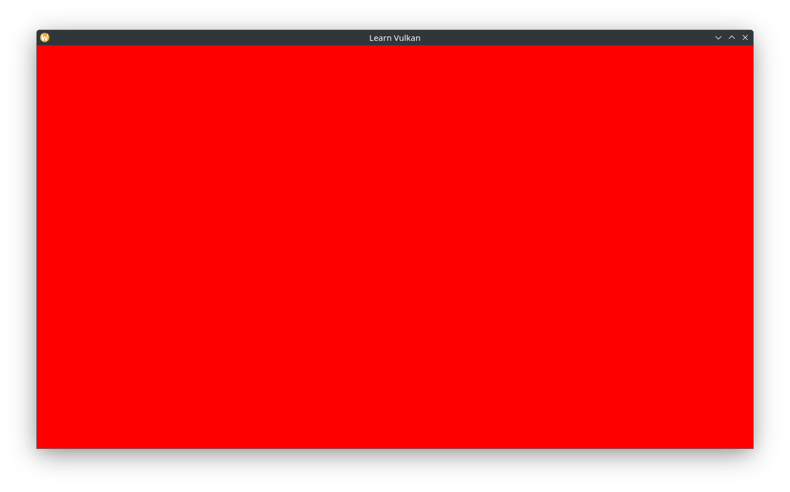

# Dynamic Rendering

Dynamic Rendering enables us to avoid using Render Passes, which are quite a bit more verbose (but also generally more performant on tiled GPUs). Here we tie together the Swapchain, Render Sync, and rendering.

In the main loop, attempt to acquire a Swapchain image / Render Target:

```cpp
auto const framebuffer_size = glfw::framebuffer_size(m_window.get());
// minimized? skip loop.
if (framebuffer_size.x <= 0 || framebuffer_size.y <= 0) { continue; }
// an eErrorOutOfDateKHR result is not guaranteed if the
// framebuffer size does not match the Swapchain image size, check it
// explicitly.
auto fb_size_changed = framebuffer_size != m_swapchain->get_size();
auto& render_sync = m_render_sync.at(m_frame_index);
auto render_target = m_swapchain->acquire_next_image(*render_sync.draw);
if (fb_size_changed || !render_target) {
  m_swapchain->recreate(framebuffer_size);
  continue;
}
```

Wait for the associated fence and reset ('un'signal) it:

```cpp
static constexpr auto fence_timeout_v =
  static_cast<std::uint64_t>(std::chrono::nanoseconds{3s}.count());
auto result = m_device->waitForFences(*render_sync.drawn, vk::True,
                    fence_timeout_v);
if (result != vk::Result::eSuccess) {
  throw std::runtime_error{"Failed to wait for Render Fence"};
}
// reset fence _after_ acquisition of image: if it fails, the
// fence remains signaled.
m_device->resetFences(*render_sync.drawn);
```

Since the fence has been reset, a queue submission must be made that signals it before continuing, otherwise the app will deadlock on the next wait (and eventually throw after 3s). We can now begin command buffer recording:

```cpp
auto command_buffer_bi = vk::CommandBufferBeginInfo{};
// this flag means recorded commands will not be reused.
command_buffer_bi.setFlags(
  vk::CommandBufferUsageFlagBits::eOneTimeSubmit);
render_sync.command_buffer.begin(command_buffer_bi);
```

We are not ready to actually render anything yet, but can clear the image to a particular color. First we need to transition the image for rendering, ie Attachment Optimal layout. Set up the image barrier and record it:

```cpp
auto dependency_info = vk::DependencyInfo{};
auto barrier = m_swapchain->base_barrier();
// Undefined => AttachmentOptimal
// we don't need to block any operations before the barrier, since we
// rely on the image acquired semaphore to block rendering.
// any color attachment operations must happen after the barrier.
barrier.setOldLayout(vk::ImageLayout::eUndefined)
  .setNewLayout(vk::ImageLayout::eAttachmentOptimal)
  .setSrcAccessMask(vk::AccessFlagBits2::eNone)
  .setSrcStageMask(vk::PipelineStageFlagBits2::eTopOfPipe)
  .setDstAccessMask(vk::AccessFlagBits2::eColorAttachmentWrite)
  .setDstStageMask(
    vk::PipelineStageFlagBits2::eColorAttachmentOutput);
dependency_info.setImageMemoryBarriers(barrier);
render_sync.command_buffer.pipelineBarrier2(dependency_info);
```

Create an Rendering Attachment Info using the acquired image as the color target. We use a red clear color, make sure the Load Op clears the image, and Store Op stores the results (currently just the cleared image):

```cpp
auto attachment_info = vk::RenderingAttachmentInfo{};
attachment_info.setImageView(render_target->image_view)
  .setImageLayout(vk::ImageLayout::eAttachmentOptimal)
  .setLoadOp(vk::AttachmentLoadOp::eClear)
  .setStoreOp(vk::AttachmentStoreOp::eStore)
  .setClearValue(vk::ClearColorValue{1.0f, 0.0f, 0.0f, 1.0f});
```

Set up a Rendering Info object with the color attachment and the entire image as the render area:

```cpp
auto rendering_info = vk::RenderingInfo{};
auto const render_area =
  vk::Rect2D{vk::Offset2D{}, render_target->extent};
rendering_info.setRenderArea(render_area)
  .setColorAttachments(attachment_info)
  .setLayerCount(1);
```

Finally, execute a render:

```cpp
render_sync.command_buffer.beginRendering(rendering_info);
// draw stuff here.
render_sync.command_buffer.endRendering();
```

Transition the image for presentation:

```cpp
// AttachmentOptimal => PresentSrc
// the barrier must wait for color attachment operations to complete.
// we don't need any post-synchronization as the present Sempahore takes
// care of that.
barrier.setOldLayout(vk::ImageLayout::eAttachmentOptimal)
  .setNewLayout(vk::ImageLayout::ePresentSrcKHR)
  .setSrcAccessMask(vk::AccessFlagBits2::eColorAttachmentWrite)
  .setSrcStageMask(vk::PipelineStageFlagBits2::eColorAttachmentOutput)
  .setDstAccessMask(vk::AccessFlagBits2::eNone)
  .setDstStageMask(vk::PipelineStageFlagBits2::eBottomOfPipe);
dependency_info.setImageMemoryBarriers(barrier);
render_sync.command_buffer.pipelineBarrier2(dependency_info);
```

End the command buffer and submit it:

```cpp
render_sync.command_buffer.end();

auto submit_info = vk::SubmitInfo2{};
auto const command_buffer_info =
  vk::CommandBufferSubmitInfo{render_sync.command_buffer};
auto wait_semaphore_info = vk::SemaphoreSubmitInfo{};
wait_semaphore_info.setSemaphore(*render_sync.draw)
  .setStageMask(vk::PipelineStageFlagBits2::eTopOfPipe);
auto signal_semaphore_info = vk::SemaphoreSubmitInfo{};
signal_semaphore_info.setSemaphore(*render_sync.present)
  .setStageMask(vk::PipelineStageFlagBits2::eColorAttachmentOutput);
submit_info.setCommandBufferInfos(command_buffer_info)
  .setWaitSemaphoreInfos(wait_semaphore_info)
  .setSignalSemaphoreInfos(signal_semaphore_info);
m_queue.submit2(submit_info, *render_sync.drawn);
```

The `draw` Semaphore will be signaled by the Swapchain when the image is ready, which will trigger this command buffer's execution. It will signal the `present` Semaphore and `drawn` Fence on completion, with the latter being waited on the next time this virtual frame is processed. Finally, we increment the frame index, pass the `present` semaphore as the one for the subsequent present operation to wait on:

```cpp
m_frame_index = (m_frame_index + 1) % m_render_sync.size();

if (!m_swapchain->present(m_queue, *render_sync.present)) {
  m_swapchain->recreate(framebuffer_size);
  continue;
}
```

> Wayland users: congratulaions, you can finally see and interact with the window!



## Render Doc on Wayland

At the time of writing, RenderDoc doesn't support inspecting Wayland applications. Temporarily force X11 (XWayland) by calling `glfwInitHint()` before `glfwInit()`:

```cpp
glfwInitHint(GLFW_PLATFORM, GLFW_PLATFORM_X11);
```

Setting up a command line option to conditionally call this is a simple and flexible approach: just set that argument in RenderDoc itself and/or pass it whenever an X11 backend is desired:

```cpp
// main.cpp
// skip the first argument.
auto args = std::span{argv, static_cast<std::size_t>(argc)}.subspan(1);
while (!args.empty()) {
  auto const arg = std::string_view{args.front()};
  if (arg == "-x" || arg == "--force-x11") {
    glfwInitHint(GLFW_PLATFORM, GLFW_PLATFORM_X11);
  }
  args = args.subspan(1);
}
lvk::App{}.run();
```
