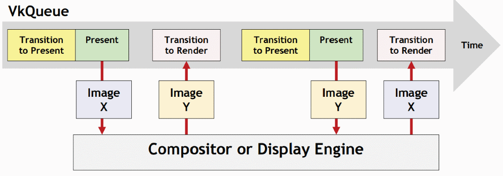

# Swapchain Loop

One part of rendering in the main loop is the Swapchain loop, which at a high level comprises of these steps:

1. Acquire a Swapchain Image
1. Render to the acquired Image
1. Present the Image (this releases the image back to the Swapchain)

There are a few nuances to deal with, for instance:

1. Acquiring (and/or presenting) will sometimes fail (eg because the Swapchain is out of date), in which case the remaining steps need to be skipped
1. The acquire command can return before the image is actually ready for use, rendering needs to be synchronized to only start after the image is ready
1. Similarly, presentation needs to be synchronized to only occur after rendering has completed
1. The images need appropriate Layout Transitions at each stage

Additionally, the number of swapchain images can vary, whereas the engine should use a fixed number of _virtual frames_: 2 for double buffering, 3 for triple (more is usually overkill). More info is available [here](https://docs.vulkan.org/samples/latest/samples/performance/swapchain_images/README.html#_double_buffering_or_triple_buffering). It's also possible for the main loop to acquire the same image before a previous render command has finished (or even started), if the Swapchain is using Mailbox Present Mode. While FIFO will block until the oldest submitted image is available (also known as vsync), we should still synchronize and wait until the acquired image has finished rendering.

## Virtual Frames

All the dynamic resources used during the rendering of a frame comprise a virtual frame. The application has a fixed number of virtual frames which it cycles through on each render pass. For synchronization, each frame will be associated with a [`vk::Fence`](https://docs.vulkan.org/spec/latest/chapters/synchronization.html#synchronization-fences) which will be waited on before rendering to it again. It will also have a pair of [`vk::Semaphore`](https://docs.vulkan.org/spec/latest/chapters/synchronization.html#synchronization-semaphores)s to synchronize the acquire, render, and present calls on the GPU (we don't need to wait for them on the CPU side / in C++). For recording commands, there will be a [`vk::CommandBuffer`](https://docs.vulkan.org/spec/latest/chapters/cmdbuffers.html) per virtual frame, where all rendering commands for that frame (including layout transitions) will be recorded.

## Image Layouts

Vulkan Images have a property known as [Image Layout](https://docs.vulkan.org/spec/latest/chapters/resources.html#resources-image-layouts). Most operations on images and their subresources require them to be in certain specific layouts, requiring transitions before (and after). A layout transition conveniently also functions as a Pipeline Barrier (think memory barrier on the GPU), enabling us to synchronize operations before and after the transition.

Vulkan Synchronization is arguably the most complicated aspect of the API, a good amount of research is recommended. Here is an [article explaining barriers](https://gpuopen.com/learn/vulkan-barriers-explained/).
