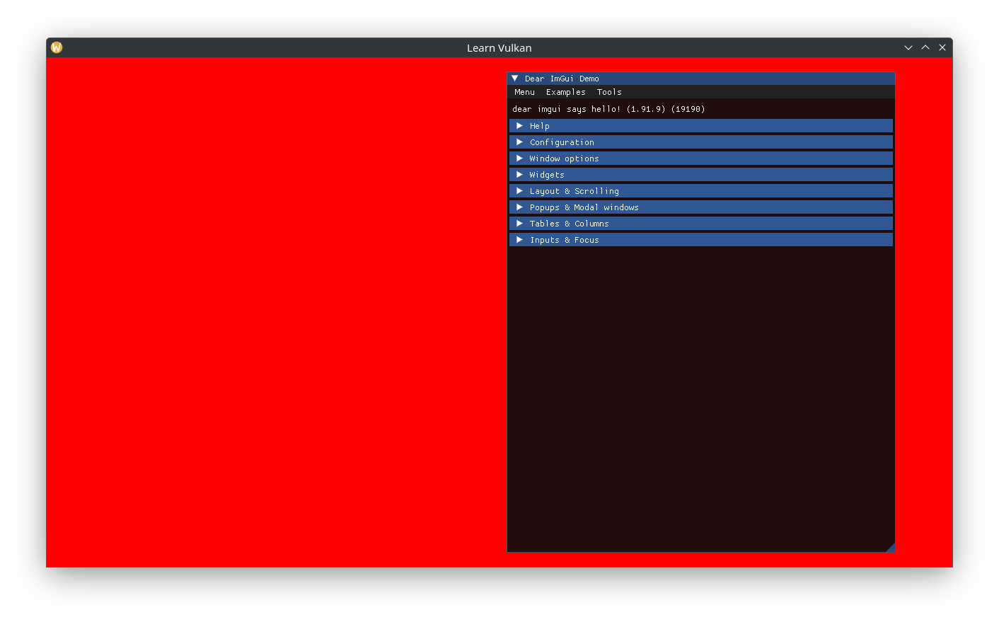

# ImGui 통합

`Swapchain`이 이미지 포맷을 외부에 노출하도록 수정하겠습니다.

```cpp
[[nodiscard]] auto get_format() const -> vk::Format {
  return m_ci.imageFormat;
}
```

`class App`은 이제 `std::optional<DearImGui>` 멤버를 담을 수 있으며, 이를 생성하는 함수를 추가하고 호출할 수 있습니다.

```cpp
void App::create_imgui() {
  auto const imgui_ci = DearImGui::CreateInfo{
    .window = m_window.get(),
    .api_version = vk_version_v,
    .instance = *m_instance,
    .physical_device = m_gpu.device,
    .queue_family = m_gpu.queue_family,
    .device = *m_device,
    .queue = m_queue,
    .color_format = m_swapchain->get_format(),
    .samples = vk::SampleCountFlagBits::e1,
  };
  m_imgui.emplace(imgui_ci);
}
```

렌더 패스를 리셋한 이후에 새로운 ImGui 프레임을 시작하고, 데모 창을 띄워봅시다.

```cpp
m_device->resetFences(*render_sync.drawn);
m_imgui->new_frame();

// ...
command_buffer.beginRendering(rendering_info);
ImGui::ShowDemoWindow();
// draw stuff here.
command_buffer.endRendering();
```

ImGui는 이 시점에서는 아무것도 그리지 않습니다(실제 그리기 명령은 커맨드 버퍼가 필요합니다). 이 부분은 상위 로직을 구성하기 위한 커스터마이징 지점입니다.

우리는 Dear ImGui를 위한 별도의 렌더 패스를 사용합니다. 이는 코드의 분리를 위한 목적도 있고, 메인 렌더 패스를 나중에 깊이 버퍼를 추가하는 것과 같은 상황에 변경할 수 있도록 하기 위함입니다 `DearImGui`는 하나의 색상 어태치먼트만 사용하는 전용 렌더 패스를 설정한다고 간주합니다.

```cpp
m_imgui->end_frame();
// we don't want to clear the image again, instead load it intact after the
// previous pass.
color_attachment.setLoadOp(vk::AttachmentLoadOp::eLoad);
rendering_info.setColorAttachments(color_attachment)
  .setPDepthAttachment(nullptr);
command_buffer.beginRendering(rendering_info);
m_imgui->render(command_buffer);
command_buffer.endRendering();
```


