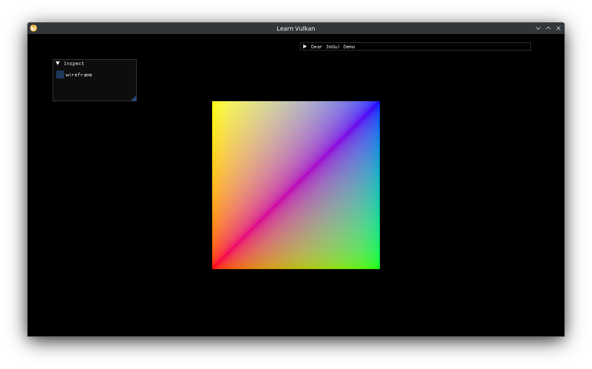

# 디스크립터 버퍼

유니폼과 스토리지 버퍼는 생성 이후 내용이 변경되지 않는 GPU 상수가 아닌 이상, N-버퍼링 되어야 합니다. 각 가상 프레임마다의 하나의 `vma::Buffer`를 `DescriptorBuffer`로 캡슐화하겠습니다.

```cpp
class DescriptorBuffer {
 public:
  explicit DescriptorBuffer(VmaAllocator allocator,
                            std::uint32_t queue_family,
                            vk::BufferUsageFlags usage);

  void write_at(std::size_t frame_index, std::span<std::byte const> bytes);

  [[nodiscard]] auto descriptor_info_at(std::size_t frame_index) const
    -> vk::DescriptorBufferInfo;

 private:
  struct Buffer {
    vma::Buffer buffer{};
    vk::DeviceSize size{};
  };

  void write_to(Buffer& out, std::span<std::byte const> bytes) const;

  VmaAllocator m_allocator{};
  std::uint32_t m_queue_family{};
  vk::BufferUsageFlags m_usage{};
  Buffered<Buffer> m_buffers{};
};
```

구현은 꽤 단순합니다. 기존의 버퍼로 충분하다면 재사용하고, 아니라면 데이터를 복사하기 전에 새로 생성합니다. 이렇게 하면 디스크립터 셋에 바인딩할 버퍼가 항상 유효한 상태임을 보장합니다.

```cpp
DescriptorBuffer::DescriptorBuffer(VmaAllocator allocator,
                                   std::uint32_t const queue_family,
                                   vk::BufferUsageFlags const usage)
  : m_allocator(allocator), m_queue_family(queue_family), m_usage(usage) {
  // ensure buffers are created and can be bound after returning.
  for (auto& buffer : m_buffers) { write_to(buffer, {}); }
}

void DescriptorBuffer::write_at(std::size_t const frame_index,
                                std::span<std::byte const> bytes) {
  write_to(m_buffers.at(frame_index), bytes);
}

auto DescriptorBuffer::descriptor_info_at(std::size_t const frame_index) const
  -> vk::DescriptorBufferInfo {
  auto const& buffer = m_buffers.at(frame_index);
  auto ret = vk::DescriptorBufferInfo{};
  ret.setBuffer(buffer.buffer.get().buffer).setRange(buffer.size);
  return ret;
}

void DescriptorBuffer::write_to(Buffer& out,
                                std::span<std::byte const> bytes) const {
  static constexpr auto blank_byte_v = std::array{std::byte{}};
  // fallback to an empty byte if bytes is empty.
  if (bytes.empty()) { bytes = blank_byte_v; }
  out.size = bytes.size();
  if (out.buffer.get().size < bytes.size()) {
    // size is too small (or buffer doesn't exist yet), recreate buffer.
    auto const buffer_ci = vma::BufferCreateInfo{
      .allocator = m_allocator,
      .usage = m_usage,
      .queue_family = m_queue_family,
    };
    out.buffer = vma::create_buffer(buffer_ci, vma::BufferMemoryType::Host,
                    out.size);
  }
  std::memcpy(out.buffer.get().mapped, bytes.data(), bytes.size());
}
```

`App`에 `DescriptorBuffer`를 저장하고 `create_vertex_buffer()`함수의 이름을 `create_shader_resources()`로 변경합니다.

```cpp
std::optional<DescriptorBuffer> m_view_ubo{};

// ...
m_vbo = vma::create_device_buffer(buffer_ci, create_command_block(),
                                  total_bytes_v);

m_view_ubo.emplace(m_allocator.get(), m_gpu.queue_family,
                   vk::BufferUsageFlagBits::eUniformBuffer);
```

뷰/프로젝션 행렬을 업데이트하고 프레임별 디스크립터 셋을 바인딩하는 함수를 추가합니다.

```cpp
void App::update_view() {
  auto const half_size = 0.5f * glm::vec2{m_framebuffer_size};
  auto const mat_projection =
    glm::ortho(-half_size.x, half_size.x, -half_size.y, half_size.y);
  auto const bytes =
    std::bit_cast<std::array<std::byte, sizeof(mat_projection)>>(
      mat_projection);
  m_view_ubo->write_at(m_frame_index, bytes);
}

// ...
void App::bind_descriptor_sets(vk::CommandBuffer const command_buffer) const {
  auto writes = std::array<vk::WriteDescriptorSet, 1>{};
  auto const& descriptor_sets = m_descriptor_sets.at(m_frame_index);
  auto const set0 = descriptor_sets[0];
  auto write = vk::WriteDescriptorSet{};
  auto const view_ubo_info = m_view_ubo->descriptor_info_at(m_frame_index);
  write.setBufferInfo(view_ubo_info)
    .setDescriptorType(vk::DescriptorType::eUniformBuffer)
    .setDescriptorCount(1)
    .setDstSet(set0)
    .setDstBinding(0);
  writes[0] = write;
  m_device->updateDescriptorSets(writes, {});

  command_buffer.bindDescriptorSets(vk::PipelineBindPoint::eGraphics,
                                    *m_pipeline_layout, 0, descriptor_sets,
                                    {});
}
```

셰이더에 디스크립터 셋 레이아웃을 추가하고, `draw()` 호출 전에 `update_view()`를 호출하며, `draw()` 내부에서 `bind_descriptor_sets()`를 호출합니다.

```cpp
auto const shader_ci = ShaderProgram::CreateInfo{
  .device = *m_device,
  .vertex_spirv = vertex_spirv,
  .fragment_spirv = fragment_spirv,
  .vertex_input = vertex_input_v,
  .set_layouts = m_set_layout_views,
};

// ...
inspect();
update_view();
draw(command_buffer);

// ...
m_shader->bind(command_buffer, m_framebuffer_size);
bind_descriptor_sets(command_buffer);
// ...
```

정점 셰이더를 이에 맞춰 변경해줍니다.

```glsl
layout (set = 0, binding = 0) uniform View {
  mat4 mat_vp;
};

// ...
void main() {
  const vec4 world_pos = vec4(a_pos, 0.0, 1.0);

  out_color = a_color;
  gl_Position = mat_vp * world_pos;
}
```

투영 공간이 이제 [ -1, 1] 범위가 아닌 프레임버퍼 크기를 기준으로 하기 때문에 정점 위치를 1픽셀보다 크게 위치하도록 업데이트합니다.

```cpp
static constexpr auto vertices_v = std::array{
  Vertex{.position = {-200.0f, -200.0f}, .color = {1.0f, 0.0f, 0.0f}},
  Vertex{.position = {200.0f, -200.0f}, .color = {0.0f, 1.0f, 0.0f}},
  Vertex{.position = {200.0f, 200.0f}, .color = {0.0f, 0.0f, 1.0f}},
  Vertex{.position = {-200.0f, 200.0f}, .color = {1.0f, 1.0f, 0.0f}},
};
```



이러한 디스크립터 버퍼가 동적으로 생성되고 파괴될 때, 관련 디스크립터 셋을 사용하는 렌더링이 모두 완료된 후에 파괴되도록 `ScopedWaiter`를 사용해 보장합니다. 또는, 프레임마다 임시 버퍼 풀을 유지하여(작거나 동적인 정점 버퍼와 유사하게) 버퍼를 개별이 아닌 일괄적으로 파괴하는 방식도 사용할 수 있습니다.
