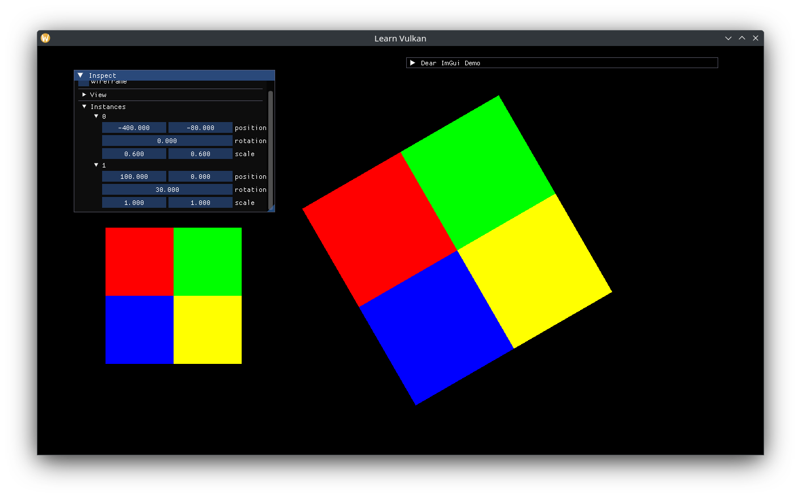

# 인스턴스 렌더링

하나의 객체를 여러 번 그려야 할 때 사용할 수 있는 방법 중 하나는 인스턴스 렌더링입니다. 기본 아이디어는 인스턴스별 데이터를 유니폼 버퍼 또는 스토리지 버퍼에 담고, 이를 정점 셰이더에서 참조하는 것입니다. 우리는 인스턴스마다 하나의 모델 행렬을 표현하겠습니다. 필요하다면 색상과 같은 정보를 포함해 프래그먼트 셰이더에서 기존 출력 색상에 곱하는 방식으로 사용할 수도 있습니다. 이러한 데이터는 스토리지 버퍼(SSBO)에 바인딩되며, 버퍼의 크기는 호출 시점에 결정됩니다.

SSBO와 인스턴스 행렬을 저장할 버퍼를 추가합니다.

```cpp
std::vector<glm::mat4> m_instance_data{}; // model matrices.
std::optional<DescriptorBuffer> m_instance_ssbo{};
```

렌더링할 인스턴스에 사용할 `Transform`을 추가하고 이를 기반으로 행렬을 업데이트하는 함수를 추가합니다.

```cpp
void update_instances();

// ...
std::array<Transform, 2> m_instances{}; // generates model matrices.

// ...
void App::update_instances() {
  m_instance_data.clear();
  m_instance_data.reserve(m_instances.size());
  for (auto const& transform : m_instances) {
    m_instance_data.push_back(transform.model_matrix());
  }
  // can't use bit_cast anymore, reinterpret data as a byte array instead.
  auto const span = std::span{m_instance_data};
  void* data = span.data();
  auto const bytes =
    std::span{static_cast<std::byte const*>(data), span.size_bytes()};
  m_instance_ssbo->write_at(m_frame_index, bytes);
}
```

디스크립터 풀을 업데이트하여 스토리지 버퍼를 지원하도록 합니다.

```cpp
// ...
vk::DescriptorPoolSize{vk::DescriptorType::eCombinedImageSampler, 2},
vk::DescriptorPoolSize{vk::DescriptorType::eStorageBuffer, 2},
```

디스크립터 셋을 2번과 해당 바인딩을 추가합니다. 이처럼 각 디스크립터 셋을 명확하게 역할별로 분리하는 것이 좋습니다.

* 디스크립터 셋 0 - : 뷰 / 카메라
* 디스크립터 셋 1 - 텍스쳐 / 머테리얼
* 디스크립터 셋 2 : 인스턴싱

```cpp
static constexpr auto set_2_bindings_v = std::array{
  layout_binding(1, vk::DescriptorType::eStorageBuffer),
};
auto set_layout_cis = std::array<vk::DescriptorSetLayoutCreateInfo, 3>{};
// ...
set_layout_cis[2].setBindings(set_2_bindings_v);
```

뷰 UBO를 생성한 이후 인스턴스용 SSBO를 생성합니다.

```cpp
m_instance_ssbo.emplace(m_allocator.get(), m_gpu.queue_family,
                        vk::BufferUsageFlagBits::eStorageBuffer);
```

`update_view()`를 호출한 다음 `update_instances()`를 호출합니다.

```cpp
// ...
update_view();
update_instances();
```

트랜스폼 확인 로직을 람다로 분리해 각 인스턴스의 트랜스폼을 검사합니다.

```cpp
static auto const inspect_transform = [](Transform& out) {
  ImGui::DragFloat2("position", &out.position.x);
  ImGui::DragFloat("rotation", &out.rotation);
  ImGui::DragFloat2("scale", &out.scale.x, 0.1f);
};

ImGui::Separator();
if (ImGui::TreeNode("View")) {
  inspect_transform(m_view_transform);
  ImGui::TreePop();
}

ImGui::Separator();
if (ImGui::TreeNode("Instances")) {
  for (std::size_t i = 0; i < m_instances.size(); ++i) {
    auto const label = std::to_string(i);
    if (ImGui::TreeNode(label.c_str())) {
      inspect_transform(m_instances.at(i));
      ImGui::TreePop();
    }
  }
  ImGui::TreePop();
}
```

SSBO를 위한 descriptorWrite도 추가합니다.

```cpp
auto writes = std::array<vk::WriteDescriptorSet, 3>{};
// ...
auto const set2 = descriptor_sets[2];
auto const instance_ssbo_info =
  m_instance_ssbo->descriptor_info_at(m_frame_index);
write.setBufferInfo(instance_ssbo_info)
  .setDescriptorType(vk::DescriptorType::eStorageBuffer)
  .setDescriptorCount(1)
  .setDstSet(set2)
  .setDstBinding(0);
writes[2] = write;
```

마지막으로, 드로우 콜의 인스턴스 수를 변경합니다.

```cpp
auto const instances = static_cast<std::uint32_t>(m_instances.size());
// m_vbo has 6 indices.
command_buffer.drawIndexed(6, instances, 0, 0, 0);
```

정점 셰이더를 수정하여 인스턴스별 모델 행렬을 적용합니다.

```glsl
// ...
layout (set = 1, binding = 1) readonly buffer Instances {
  mat4 mat_ms[];
};

// ...
const mat4 mat_m = mat_ms[gl_InstanceIndex];
const vec4 world_pos = mat_m * vec4(a_pos, 0.0, 1.0);
```


