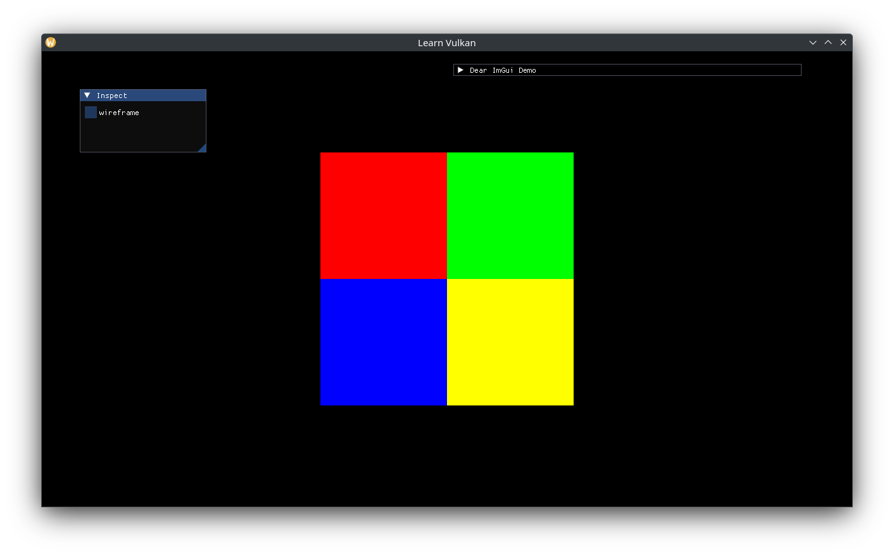

# 텍스쳐

대부분의 복잡한 작업은 `vma`에서 처리하기 때문에, `Texture`는 다음 세 가지로 구성됩니다.

1. 샘플링될 이미지
2. 해당 이미지의 이미지 뷰
3. 고유한 샘플러

`texture.hpp`에 기본 샘플러를 생성하겠습니다.

```cpp
[[nodiscard]] constexpr auto
create_sampler_ci(vk::SamplerAddressMode const wrap, vk::Filter const filter) {
  auto ret = vk::SamplerCreateInfo{};
  ret.setAddressModeU(wrap)
    .setAddressModeV(wrap)
    .setAddressModeW(wrap)
    .setMinFilter(filter)
    .setMagFilter(filter)
    .setMaxLod(VK_LOD_CLAMP_NONE)
    .setBorderColor(vk::BorderColor::eFloatTransparentBlack)
    .setMipmapMode(vk::SamplerMipmapMode::eNearest);
  return ret;
}

constexpr auto sampler_ci_v = create_sampler_ci(
  vk::SamplerAddressMode::eClampToEdge, vk::Filter::eLinear);
```

CreateInfo와 텍스쳐 타입을 정의합니다.


```cpp
struct TextureCreateInfo {
  vk::Device device;
  VmaAllocator allocator;
  std::uint32_t queue_family;
  CommandBlock command_block;
  Bitmap bitmap;

  vk::SamplerCreateInfo sampler{sampler_ci_v};
};

class Texture {
 public:
  using CreateInfo = TextureCreateInfo;

  explicit Texture(CreateInfo create_info);

  [[nodiscard]] auto descriptor_info() const -> vk::DescriptorImageInfo;

 private:
  vma::Image m_image{};
  vk::UniqueImageView m_view{};
  vk::UniqueSampler m_sampler{};
};
```

에러가 발생 시 사용할(fallback) 비트맵 상수도 추가하겠습니다.

```cpp
// 4-channels.
constexpr auto white_pixel_v = std::array{std::byte{0xff}, std::byte{0xff},
                                          std::byte{0xff}, std::byte{0xff}};
// fallback bitmap.
constexpr auto white_bitmap_v = Bitmap{
  .bytes = white_pixel_v,
  .size = {1, 1},
};

// ...
Texture::Texture(CreateInfo create_info) {
  if (create_info.bitmap.bytes.empty() || create_info.bitmap.size.x <= 0 ||
    create_info.bitmap.size.y <= 0) {
    create_info.bitmap = white_bitmap_v;
  }

  auto const image_ci = vma::ImageCreateInfo{
    .allocator = create_info.allocator,
    .queue_family = create_info.queue_family,
  };
  m_image = vma::create_sampled_image(
    image_ci, std::move(create_info.command_block), create_info.bitmap);

  auto image_view_ci = vk::ImageViewCreateInfo{};
  auto subresource_range = vk::ImageSubresourceRange{};
  subresource_range.setAspectMask(vk::ImageAspectFlagBits::eColor)
    .setLayerCount(1)
    .setLevelCount(m_image.get().levels);

  image_view_ci.setImage(m_image.get().image)
    .setViewType(vk::ImageViewType::e2D)
    .setFormat(m_image.get().format)
    .setSubresourceRange(subresource_range);
  m_view = create_info.device.createImageViewUnique(image_view_ci);

  m_sampler = create_info.device.createSamplerUnique(create_info.sampler);
}

auto Texture::descriptor_info() const -> vk::DescriptorImageInfo {
  auto ret = vk::DescriptorImageInfo{};
  ret.setImageView(*m_view)
    .setImageLayout(vk::ImageLayout::eShaderReadOnlyOptimal)
    .setSampler(*m_sampler);
  return ret;
}
```

텍스쳐를 샘플링하려면 `Vertex`에 UV 좌표를 추가해야 합니다.

```cpp
struct Vertex {
  glm::vec2 position{};
  glm::vec3 color{1.0f};
  glm::vec2 uv{};
};

// two vertex attributes: position at 0, color at 1.
constexpr auto vertex_attributes_v = std::array{
  // the format matches the type and layout of data: vec2 => 2x 32-bit floats.
  vk::VertexInputAttributeDescription2EXT{0, 0, vk::Format::eR32G32Sfloat,
                      offsetof(Vertex, position)},
  // vec3 => 3x 32-bit floats
  vk::VertexInputAttributeDescription2EXT{1, 0, vk::Format::eR32G32B32Sfloat,
                      offsetof(Vertex, color)},
  // vec2 => 2x 32-bit floats
  vk::VertexInputAttributeDescription2EXT{2, 0, vk::Format::eR32G32Sfloat,
                      offsetof(Vertex, uv)},
};
```

`App`에 텍스쳐를 담고 다른 셰이더 자원도 함께 생성하겠습니다.

```cpp
std::optional<Texture> m_texture{};

// ...
using Pixel = std::array<std::byte, 4>;
static constexpr auto rgby_pixels_v = std::array{
  Pixel{std::byte{0xff}, {}, {}, std::byte{0xff}},
  Pixel{std::byte{}, std::byte{0xff}, {}, std::byte{0xff}},
  Pixel{std::byte{}, {}, std::byte{0xff}, std::byte{0xff}},
  Pixel{std::byte{0xff}, std::byte{0xff}, {}, std::byte{0xff}},
};
static constexpr auto rgby_bytes_v =
  std::bit_cast<std::array<std::byte, sizeof(rgby_pixels_v)>>(
    rgby_pixels_v);
static constexpr auto rgby_bitmap_v = Bitmap{
  .bytes = rgby_bytes_v,
  .size = {2, 2},
};
auto texture_ci = Texture::CreateInfo{
  .device = *m_device,
  .allocator = m_allocator.get(),
  .queue_family = m_gpu.queue_family,
  .command_block = create_command_block(),
  .bitmap = rgby_bitmap_v,
};
// use Nearest filtering instead of Linear (interpolation).
texture_ci.sampler.setMagFilter(vk::Filter::eNearest);
m_texture.emplace(std::move(texture_ci));
```

DescriptorPoolSize를 업데이트해 CombinedImageSampler도 포함하도록 수정합니다.

```cpp
/// ...
vk::DescriptorPoolSize{vk::DescriptorType::eUniformBuffer, 2},
vk::DescriptorPoolSize{vk::DescriptorType::eCombinedImageSampler, 2},
```

새로운 디스크립터 셋(1번)의 바인딩 0번에 CombinedImageSampler를 설정합니다. 바인딩 호출 최적화를 하지 않을 경우, set 0의 바인딩 1번에 추가해도 괜찮습니다.

```cpp
static constexpr auto set_1_bindings_v = std::array{
  layout_binding(0, vk::DescriptorType::eCombinedImageSampler),
};
auto set_layout_cis = std::array<vk::DescriptorSetLayoutCreateInfo, 2>{};
set_layout_cis[0].setBindings(set_0_bindings_v);
set_layout_cis[1].setBindings(set_1_bindings_v);
```

정점 색상 값을 지우고 사각형에 UV를 설정합니다. Vulkan에서의 UV 공간은 GLFW 윈도우 공간과 동일합니다. 왼쪽 위가 원점이고, 오른쪽이 +X, 아래쪽이 +Y입니다.

```cpp
static constexpr auto vertices_v = std::array{
  Vertex{.position = {-200.0f, -200.0f}, .uv = {0.0f, 1.0f}},
  Vertex{.position = {200.0f, -200.0f}, .uv = {1.0f, 1.0f}},
  Vertex{.position = {200.0f, 200.0f}, .uv = {1.0f, 0.0f}},
  Vertex{.position = {-200.0f, 200.0f}, .uv = {0.0f, 0.0f}},
};
```

마지막으로, DescriptorWrite를 업데이트 합니다.

```cpp
auto writes = std::array<vk::WriteDescriptorSet, 2>{};
// ...
auto const set1 = descriptor_sets[1];
auto const image_info = m_texture->descriptor_info();
write.setImageInfo(image_info)
  .setDescriptorType(vk::DescriptorType::eCombinedImageSampler)
  .setDescriptorCount(1)
  .setDstSet(set1)
  .setDstBinding(0);
writes[1] = write;
```

텍스쳐는 N-버퍼링되지 않기 때문에(이는 GPU 상수입니다), 디스크립터 셋도 텍스쳐 생성 이후 한번만 업데이트하면 됩니다.

UV 정점 속성을 정점 셰이더에 추가하고 이를 프래그먼트 셰이더로 전달합니다.

```glsl
layout (location = 2) in vec2 a_uv;

// ...
layout (location = 1) out vec2 out_uv;

// ...
out_color = a_color;
out_uv = a_uv;
```

셋 1번과 그에 맞는 UV 좌표도 프래그먼트 셰이더에 추가하고, 샘플링한 텍스쳐 색상과 정점 색상을 섞어봅시다.

```glsl
layout (set = 1, binding = 0) uniform sampler2D tex;

// ...
layout (location = 1) in vec2 in_uv;

// ...
out_color = vec4(in_color, 1.0) * texture(tex, in_uv);
```



밉맵을 생성하기 위해서는 [Vulkan 공식 예제](https://docs.vulkan.org/samples/latest/samples/api/hpp_texture_mipmap_generation/README.html#_generating_the_mip_chain)를 참고하세요. 고수준 절차는 다음과 같습니다.

1. 이미지 크기에 기반하여 밉 레벨을 계산합니다.
2. 원하는 밉 레벨 수를 갖는 이미지를 생성합니다.
3. 첫 번째 밉 레벨에 원본 데이터를 복사합니다.
4. 첫 번째 밉 레벨의 레이아웃을 TransferSrc로 변경합니다.
5. 모든 밉 레벨을 순회하며 다음을 수행합니다.
   1. 현재 밉 레벨의 레이아웃을 TransferDst로 변경합니다.
   2. 이전 밉 레벨에서 현재 밉 레벨로 ImageBlit 작업을 수행합니다.
   3. 현재 밉 레벨의 레이아웃을 TransferSrc로 변경합니다.
6. 모든 레벨의 레이아웃을 ShaderRead로 변경합니다.
