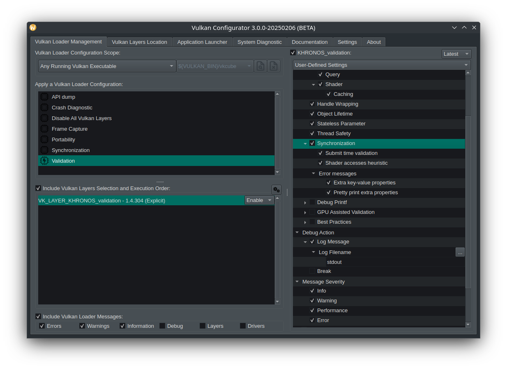

# 검증 레이어

애플리케이션이 Vulkan과 상호작용할 때 거치는 영역인 로더(loader)는 매우 강력하고 유연합니다. [여기](https://github.com/KhronosGroup/Vulkan-Loader/blob/main/docs/LoaderInterfaceArchitecture.md)에서 더 자세한 내용을 확인할 수 있습니다. 이 로더의 설계는 API 호출을 구성 가능한 레이어를 통해 연결할 수 있게 해주며, 이는 예를 들어 오버레이 구현에 사용될 수 있고, 이 중 우리에게 가장 중요한 것은 [검증 레이어](https://github.com/KhronosGroup/Vulkan-ValidationLayers/blob/main/docs/README.md) 입니다.

크로노스 그룹의 [권장사항](https://github.com/KhronosGroup/Vulkan-ValidationLayers/blob/main/docs/khronos_validation_layer.md#vkconfig)대로, 검증 레이어를 사용할 때는 [Vulkan Configurator (GUI)](https://github.com/LunarG/VulkanTools/tree/main/vkconfig_gui)를 사용하는 것이 좋습니다. 이 애플리케이션은 Vulkan SDK에 포함되어 있으며, 애플리케이션을 개발하는 동안 실행 상태로 유지해야 합니다. 또한, 이 툴이 감지된 애플리케이션에 검증 레이어를 주입하고, 동기화 검증 기능이 활성화되어 있는지 확인하세요. 이 접근 방식은 런타임 시 많은 유연성을 제공하며, 예를 들어 오류 발생 시 디버거 중단 설정(VkConfig가 디버거를 중단시킴) 같은 기능도 포함됩니다. 이와 더불어, 애플리케이션 내부에 별도의 검증 레이어 관련 코드를 작성할 필요가 없어집니다.

> 주의 : 개발(또는 데스크탑) 환경의 `PATH` 환경 변수를 수정하거나, 지원되는 시스템에서는 `LD_LIBRARY_PATH`를 사용하여 SDK의 바이너리 경로가 우선적으로 인식되도록 설정해야 합니다.

