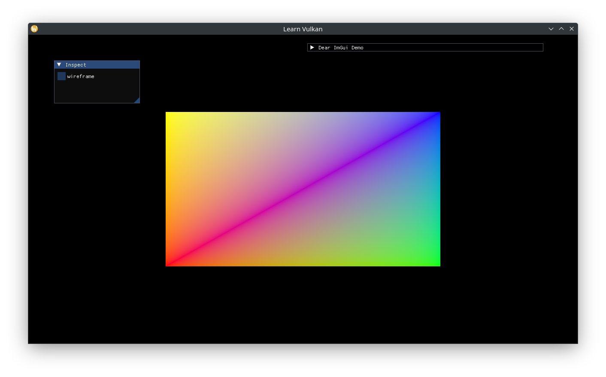

# 디바이스 버퍼

여기서는 정점 버퍼에 디바이스 버퍼만을 사용합니다. 정점과 인덱스 정보를 하나의 VBO로 묶어 사용할 것입니다. 따라서 생성 함수는 데이터를 받아 버퍼 복사를 수행한 후 반환합니다. 기본적으로 반환값은 "GPU 상수" 버퍼일 것입니다. 정점과 인덱스 데이터를 하나의 연속된 바이트로 강제로 묶는 대신, 각 데이터를 별도의 범위로 사용할 수 있도록 생성 함수는 span을 인자로 받습니다.

```cpp
// disparate byte spans.
using ByteSpans = std::span<std::span<std::byte const> const>;

// returns a Device Buffer with each byte span sequentially written.
[[nodiscard]] auto create_device_buffer(BufferCreateInfo const& create_info,
                                        CommandBlock command_block,
                                        ByteSpans const& byte_spans) -> Buffer;
```

`create_device_buffer()`는 다음과 같습니다.

```cpp
auto vma::create_device_buffer(BufferCreateInfo const& create_info,
                               CommandBlock command_block,
                               ByteSpans const& byte_spans) -> Buffer {
  auto const total_size = std::accumulate(
    byte_spans.begin(), byte_spans.end(), 0uz,
    [](std::size_t const n, std::span<std::byte const> bytes) {
      return n + bytes.size();
    });

  auto staging_ci = create_info;
  staging_ci.usage = vk::BufferUsageFlagBits::eTransferSrc;

  // create staging Host Buffer with TransferSrc usage.
  auto staging_buffer =
    create_buffer(staging_ci, BufferMemoryType::Host, total_size);
  // create the Device Buffer.
  auto ret = create_buffer(create_info, BufferMemoryType::Device, total_size);
  // can't do anything if either buffer creation failed.
  if (!staging_buffer.get().buffer || !ret.get().buffer) { return {}; }

  // copy byte spans into staging buffer.
  auto dst = staging_buffer.get().mapped_span();
  for (auto const bytes : byte_spans) {
    std::memcpy(dst.data(), bytes.data(), bytes.size());
    dst = dst.subspan(bytes.size());
  }

  // record buffer copy operation.
  auto buffer_copy = vk::BufferCopy2{};
  buffer_copy.setSize(total_size);
  auto copy_buffer_info = vk::CopyBufferInfo2{};
  copy_buffer_info.setSrcBuffer(staging_buffer.get().buffer)
    .setDstBuffer(ret.get().buffer)
    .setRegions(buffer_copy);
  command_block.command_buffer().copyBuffer2(copy_buffer_info);

  // submit and wait.
  // waiting here is necessary to keep the staging buffer alive while the GPU
  // accesses it through the recorded commands.
  // this is also why the function takes ownership of the passed CommandBlock
  // instead of just referencing it / taking a vk::CommandBuffer.
  command_block.submit_and_wait();

  return ret;
}
```

`App`에 command block pool을 추가하고 commandblock을 생성하는 함수를 추가합니다.

```cpp
void App::create_cmd_block_pool() {
  auto command_pool_ci = vk::CommandPoolCreateInfo{};
  command_pool_ci
    .setQueueFamilyIndex(m_gpu.queue_family)
    // this flag indicates that the allocated Command Buffers will be
    // short-lived.
    .setFlags(vk::CommandPoolCreateFlagBits::eTransient);
  m_cmd_block_pool = m_device->createCommandPoolUnique(command_pool_ci);
}

auto App::create_command_block() const -> CommandBlock {
  return CommandBlock{*m_device, m_queue, *m_cmd_block_pool};
}
```

`create_vertex_buffer()`를 업데이트하여 사각형을 생성하도록 합니다.

```cpp
template <typename T>
[[nodiscard]] constexpr auto to_byte_array(T const& t) {
  return std::bit_cast<std::array<std::byte, sizeof(T)>>(t);
}

// ...
void App::create_vertex_buffer() {
  // vertices of a quad.
  static constexpr auto vertices_v = std::array{
    Vertex{.position = {-0.5f, -0.5f}, .color = {1.0f, 0.0f, 0.0f}},
    Vertex{.position = {0.5f, -0.5f}, .color = {0.0f, 1.0f, 0.0f}},
    Vertex{.position = {0.5f, 0.5f}, .color = {0.0f, 0.0f, 1.0f}},
    Vertex{.position = {-0.5f, 0.5f}, .color = {1.0f, 1.0f, 0.0f}},
  };
  static constexpr auto indices_v = std::array{
    0u, 1u, 2u, 2u, 3u, 0u,
  };
  static constexpr auto vertices_bytes_v = to_byte_array(vertices_v);
  static constexpr auto indices_bytes_v = to_byte_array(indices_v);
  static constexpr auto total_bytes_v =
    std::array<std::span<std::byte const>, 2>{
      vertices_bytes_v,
      indices_bytes_v,
    };
  // we want to write total_bytes_v to a Device VertexBuffer | IndexBuffer.
  m_vbo = vma::create_device_buffer(m_allocator.get(),
                                    vk::BufferUsageFlagBits::eVertexBuffer |
                                      vk::BufferUsageFlagBits::eIndexBuffer,
                                    create_command_block(), total_bytes_v);
}
```

`draw()`함수를 이에 맞춰 변경합니다.

```cpp
void App::draw(vk::CommandBuffer const command_buffer) const {
  m_shader->bind(command_buffer, m_framebuffer_size);
  // single VBO at binding 0 at no offset.
  command_buffer.bindVertexBuffers(0, m_vbo.get().buffer, vk::DeviceSize{});
  // u32 indices after offset of 4 vertices.
  command_buffer.bindIndexBuffer(m_vbo.get().buffer, 4 * sizeof(Vertex),
                                 vk::IndexType::eUint32);
  // m_vbo has 6 indices.
  command_buffer.drawIndexed(6, 1, 0, 0, 0);
}
```


