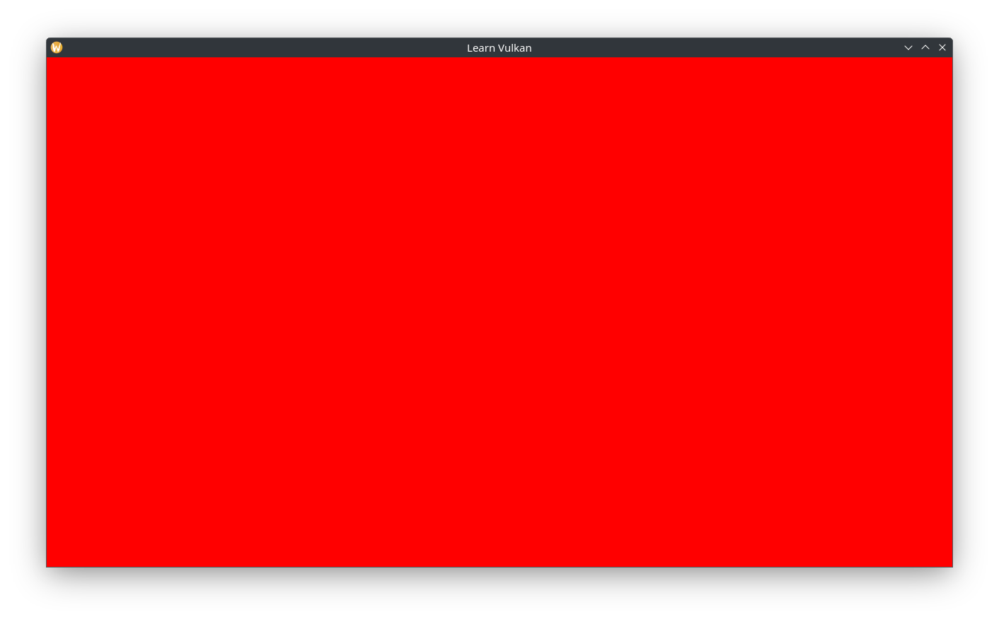

# 동적 렌더링

동적 렌더링을 활성화하면 비교적 복잡한 렌더 패스를 사용하지 않아도 됩니다. 다만 렌더 패스는 타일 기반 GPU에서 조금 더 이점을 갖습니다. 여기서는 스왑체인, 렌더 싱크, 그리고 렌더링 자체를 하나로 묶는 작업을 진행하겠습니다. 아직 실제로 화면에 무언가를 렌더링할 준비가 된 것은 아니지만, 특정 색상으로 이미지를 초기화할 수는 있습니다.

아래와 같은 멤버를 `App`에 추가하겠습니다.

```cpp
auto acquire_render_target() -> bool;
auto begin_frame() -> vk::CommandBuffer;
void transition_for_render(vk::CommandBuffer command_buffer) const;
void render(vk::CommandBuffer command_buffer);
void transition_for_present(vk::CommandBuffer command_buffer) const;
void submit_and_present();

// ...
glm::ivec2 m_framebuffer_size{};
std::optional<RenderTarget> m_render_target{};
```

이제 메인 루프는 이 멤버들을 활용하여 스왑체인과 렌더링 루프를 구현할 수 있습니다.

```cpp
while (glfwWindowShouldClose(m_window.get()) == GLFW_FALSE) {
  glfwPollEvents();
  if (!acquire_render_target()) { continue; }
  auto const command_buffer = begin_frame();
  transition_for_render(command_buffer);
  render(command_buffer);
  transition_for_present(command_buffer);
  submit_and_present();
}
```

스왑체인 이미지를 받아오기 전에, 현재 프레임의 펜스를 대기해야 합니다. 이미지를 받아오는 것이 성공하면 해당 펜스를 리셋(unsignal)합니다.

```cpp
auto App::acquire_render_target() -> bool {
  m_framebuffer_size = glfw::framebuffer_size(m_window.get());
  // minimized? skip loop.
  if (m_framebuffer_size.x <= 0 || m_framebuffer_size.y <= 0) {
    return false;
  }

  auto& render_sync = m_render_sync.at(m_frame_index);

  // wait for the fence to be signaled.
  static constexpr auto fence_timeout_v =
    static_cast<std::uint64_t>(std::chrono::nanoseconds{3s}.count());
  auto result =
    m_device->waitForFences(*render_sync.drawn, vk::True, fence_timeout_v);
  if (result != vk::Result::eSuccess) {
    throw std::runtime_error{"Failed to wait for Render Fence"};
  }

  m_render_target = m_swapchain->acquire_next_image(*render_sync.draw);
  if (!m_render_target) {
    // acquire failure => ErrorOutOfDate. Recreate Swapchain.
    m_swapchain->recreate(m_framebuffer_size);
    return false;
  }

  // reset fence _after_ acquisition of image: if it fails, the
  // fence remains signaled.
  m_device->resetFences(*render_sync.drawn);

  return true;
}
```

펜스가 리셋되었기 때문에, 다음 동작을 진행하기 전에 해당 펜스를 signal하도록 반드시 큐에 커맨드 버퍼가 제출되어야 합니다. 그렇지 않으면 다음 루프에서 펜스를 기다리는 과정에서 교착 상태에 빠지고, 결국 3초 후 예외가 발생하게 됩니다. 이제 커맨드 버퍼 기록을 시작하겠습니다.

```cpp
auto App::begin_frame() -> vk::CommandBuffer {
  auto const& render_sync = m_render_sync.at(m_frame_index);

  auto command_buffer_bi = vk::CommandBufferBeginInfo{};
  // this flag means recorded commands will not be reused.
  command_buffer_bi.setFlags(vk::CommandBufferUsageFlagBits::eOneTimeSubmit);
  render_sync.command_buffer.begin(command_buffer_bi);
  return render_sync.command_buffer;
}
```

렌더링에 사용할 이미지의 레이아웃을 AttachmentOptimal 레이아웃으로 전환합니다. 이를 위해 이미지 배리어를 설정하고 커맨드 버퍼에 기록합니다.

```cpp
void App::transition_for_render(vk::CommandBuffer const command_buffer) const {
  auto dependency_info = vk::DependencyInfo{};
  auto barrier = m_swapchain->base_barrier();
  // Undefined => AttachmentOptimal
  // the barrier must wait for prior color attachment operations to complete,
  // and block subsequent ones.
  barrier.setOldLayout(vk::ImageLayout::eUndefined)
    .setNewLayout(vk::ImageLayout::eAttachmentOptimal)
    .setSrcAccessMask(vk::AccessFlagBits2::eColorAttachmentRead |
              vk::AccessFlagBits2::eColorAttachmentWrite)
    .setSrcStageMask(vk::PipelineStageFlagBits2::eColorAttachmentOutput)
    .setDstAccessMask(barrier.srcAccessMask)
    .setDstStageMask(barrier.srcStageMask);
  dependency_info.setImageMemoryBarriers(barrier);
  command_buffer.pipelineBarrier2(dependency_info);
}
```

받아온 이미지를 색상 타겟으로 사용하는 RenderingAttachmentInfo를 생성합니다. 빨간 색을 초기화 색상으로 사용하고, LoadOp가 이미지를 초기화하며, StoreOp는 결과를 담도록 해야 합니다(현재는 초기화된 이미지만 저장합니다). 이 colorAttachment와 전체 이미지를 렌더링 영역으로 설정한 RenderingInfo 구조체를 생성합니다. 마지막으로 렌더링을 실행합니다.

```cpp
void App::render(vk::CommandBuffer const command_buffer) {
  auto color_attachment = vk::RenderingAttachmentInfo{};
  color_attachment.setImageView(m_render_target->image_view)
    .setImageLayout(vk::ImageLayout::eAttachmentOptimal)
    .setLoadOp(vk::AttachmentLoadOp::eClear)
    .setStoreOp(vk::AttachmentStoreOp::eStore)
    // temporarily red.
    .setClearValue(vk::ClearColorValue{1.0f, 0.0f, 0.0f, 1.0f});
  auto rendering_info = vk::RenderingInfo{};
  auto const render_area =
    vk::Rect2D{vk::Offset2D{}, m_render_target->extent};
  rendering_info.setRenderArea(render_area)
    .setColorAttachments(color_attachment)
    .setLayerCount(1);

  command_buffer.beginRendering(rendering_info);
  // draw stuff here.
  command_buffer.endRendering();
}
```

렌더링이 끝나면 이미지를 표시하기 위해 레이아웃을 전환합니다.

```cpp
void App::transition_for_present(vk::CommandBuffer const command_buffer) const {
  auto dependency_info = vk::DependencyInfo{};
  auto barrier = m_swapchain->base_barrier();
  // AttachmentOptimal => PresentSrc
  // the barrier must wait for prior color attachment operations to complete,
  // and block subsequent ones.
  barrier.setOldLayout(vk::ImageLayout::eAttachmentOptimal)
    .setNewLayout(vk::ImageLayout::ePresentSrcKHR)
    .setSrcAccessMask(vk::AccessFlagBits2::eColorAttachmentRead |
              vk::AccessFlagBits2::eColorAttachmentWrite)
    .setSrcStageMask(vk::PipelineStageFlagBits2::eColorAttachmentOutput)
    .setDstAccessMask(barrier.srcAccessMask)
    .setDstStageMask(barrier.srcStageMask);
  dependency_info.setImageMemoryBarriers(barrier);
  command_buffer.pipelineBarrier2(dependency_info);
}
```

커맨드 버퍼를 끝내고(End) 이를 제출합니다. 스왑체인 이미지를 사용할 준비가 되면 `draw`세마포어가 시그널 되고, 이로 인해 커맨드 버퍼가 실행됩니다. 렌더링이 완료되면 `present` 세마포어와 `drawn` 펜스가 시그널됩니다. 이후 동일한 가상 프레임이 다시 처리될 때 이 펜스를 기다리게 됩니다. 마지막으로 프레임 인덱스를 증가시키고, 다음 표시 작업이 대기할 수 있도록 `present` 세마포어를 전달합니다.

```cpp
void App::submit_and_present() {
  auto const& render_sync = m_render_sync.at(m_frame_index);
  render_sync.command_buffer.end();

  auto submit_info = vk::SubmitInfo2{};
  auto const command_buffer_info =
    vk::CommandBufferSubmitInfo{render_sync.command_buffer};
  auto wait_semaphore_info = vk::SemaphoreSubmitInfo{};
  wait_semaphore_info.setSemaphore(*render_sync.draw)
    .setStageMask(vk::PipelineStageFlagBits2::eColorAttachmentOutput);
  auto signal_semaphore_info = vk::SemaphoreSubmitInfo{};
  signal_semaphore_info.setSemaphore(m_swapchain->get_present_semaphore())
    .setStageMask(vk::PipelineStageFlagBits2::eColorAttachmentOutput);
  submit_info.setCommandBufferInfos(command_buffer_info)
    .setWaitSemaphoreInfos(wait_semaphore_info)
    .setSignalSemaphoreInfos(signal_semaphore_info);
  m_queue.submit2(submit_info, *render_sync.drawn);

  m_frame_index = (m_frame_index + 1) % m_render_sync.size();
  m_render_target.reset();

  // an eErrorOutOfDateKHR result is not guaranteed if the
  // framebuffer size does not match the Swapchain image size, check it
  // explicitly.
  auto const fb_size_changed = m_framebuffer_size != m_swapchain->get_size();
  auto const out_of_date = !m_swapchain->present(m_queue);
  if (fb_size_changed || out_of_date) {
    m_swapchain->recreate(m_framebuffer_size);
  }
}
```

> Wayland 사용자라면 이제 마침내 창과 상호작용할 수 있습니다!



## Wayland에서의 RenderDoc

이 글을 작성하는 시점에서는 RenderDoc이 Wayland 애플리케이션을 지원하지 않습니다. `glfwInit()` 이전에 `glfwInitHint()`를 호출하여 임시로 X11(XWayland)를 사용하도록 강제할 수 있습니다.

```cpp
glfwInitHint(GLFW_PLATFORM, GLFW_PLATFORM_X11);
```

커맨드라인 옵션을 활용해 이 설정을 조건적으로 적용하는 것이 간단하고 유연한 방식입니다. RenderDoc에서 해당 인자를 설정하거나, X11 백엔드를 사용하고자 할 때마다 넘겨주는 식으로 처리하면 됩니다.

```cpp
// main.cpp
// skip the first argument.
auto args = std::span{argv, static_cast<std::size_t>(argc)}.subspan(1);
while (!args.empty()) {
  auto const arg = std::string_view{args.front()};
  if (arg == "-x" || arg == "--force-x11") {
    glfwInitHint(GLFW_PLATFORM, GLFW_PLATFORM_X11);
  }
  args = args.subspan(1);
}
lvk::App{}.run();
```
