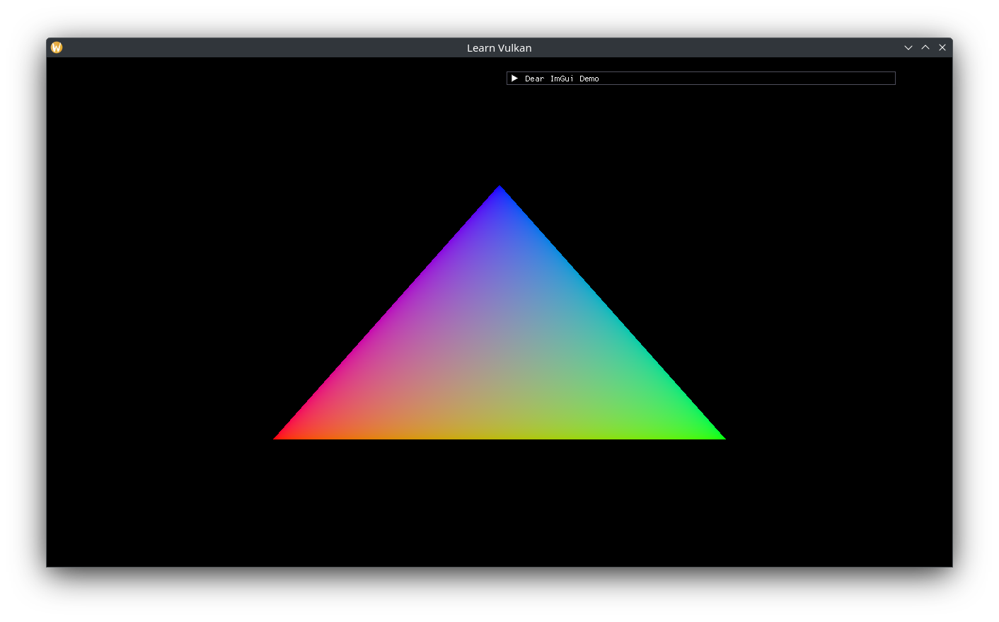

# 삼각형 그리기

`App` 클래스에 `ShaderProgram`과 이를 생성하는 함수를 추가합니다.

```cpp
[[nodiscard]] auto asset_path(std::string_view uri) const -> fs::path;

// ...
void create_shader();

// ...
std::optional<ShaderProgram> m_shader{};
```

`asset_path()`와 `create_shader()`를 구현하고 호출합니다.

```cpp
void App::create_shader() {
  auto const vertex_spirv = to_spir_v(asset_path("shader.vert"));
  auto const fragment_spirv = to_spir_v(asset_path("shader.frag"));
  auto const shader_ci = ShaderProgram::CreateInfo{
    .device = *m_device,
    .vertex_spirv = vertex_spirv,
    .fragment_spirv = fragment_spirv,
    .vertex_input = {},
    .set_layouts = {},
  };
  m_shader.emplace(shader_ci);
}

auto App::asset_path(std::string_view const uri) const -> fs::path {
  return m_assets_dir / uri;
}
```

`render()`가 걷잡을 수 없이 커지기 전에, 고수준 로직을 두 멤버 함수로 분리합니다.

```cpp
// ImGui code goes here.
void inspect();
// Issue draw calls here.
void draw(vk::CommandBuffer command_buffer) const;

// ...
void App::inspect() {
  ImGui::ShowDemoWindow();
  // TODO
}

// ...
command_buffer.beginRendering(rendering_info);
inspect();
draw(command_buffer);
command_buffer.endRendering();
```

이제 셰이더를 바인딩하고 이를 삼각형을 그리는 데 사용할 수 있습니다. `draw()`함수를 `const`로 만들어 `App`을 건드리지 않도록 합니다.

```cpp
void App::draw(vk::CommandBuffer const command_buffer) const {
  m_shader->bind(command_buffer, m_framebuffer_size);
  // current shader has hard-coded logic for 3 vertices.
  command_buffer.draw(3, 1, 0, 0);
}
```


셰이더를 각 정점에 대해 보간된 RGB를 사용하도록 업데이트합니다. 

```glsl
// shader.vert

layout (location = 0) out vec3 out_color;

// ...
const vec3 colors[] = {
  vec3(1.0, 0.0, 0.0),
  vec3(0.0, 1.0, 0.0),
  vec3(0.0, 0.0, 1.0),
};

// ...
out_color = colors[gl_VertexIndex];

// shader.frag

layout (location = 0) in vec3 in_color;

// ...
out_color = vec4(in_color, 1.0);
```

> `assets/`에 있는 두 SPIR-V 파일을 다시 컴파일하는 것을 잊지 마세요. 

그리고 초기화 색상을 검은 색으로 설정합니다.

```cpp
// ...
.setClearValue(vk::ClearColorValue{0.0f, 0.0f, 0.0f, 1.0f});
```

이제 Vulkan에서 sRGB 포맷으로 표현되는 삼각형을 볼 수 있습니다.



## 동적 상태 변경하기

ImGui 창을 사용해 파이프라인 상태를 관찰하거나 일부 설정을 변경할 수 있습니다.

```cpp
ImGui::SetNextWindowSize({200.0f, 100.0f}, ImGuiCond_Once);
if (ImGui::Begin("Inspect")) {
  if (ImGui::Checkbox("wireframe", &m_wireframe)) {
    m_shader->polygon_mode =
      m_wireframe ? vk::PolygonMode::eLine : vk::PolygonMode::eFill;
  }
  if (m_wireframe) {
    auto const& line_width_range =
      m_gpu.properties.limits.lineWidthRange;
    ImGui::SetNextItemWidth(100.0f);
    ImGui::DragFloat("line width", &m_shader->line_width, 0.25f,
              line_width_range[0], line_width_range[1]);
  }
}
ImGui::End();
```


