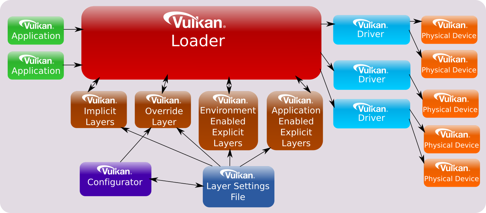

# Validation Layers

Vulkan 中與應用程式互動的部分為 Vulkan loader，其本身非常強大且具有彈性。 你可以在[這裡](https://github.com/KhronosGroup/Vulkan-Loader/blob/main/docs/LoaderInterfaceArchitecture.md)讀取更詳細的說明。 它的設計使我們能夠透過可配置的「layer」來串接 API 的呼叫，像是 overlay，或對我們來說最重要的「[Validation Layers](https://github.com/KhronosGroup/Vulkan-ValidationLayers/blob/main/docs/README.md)」

根據 Khronos Group 的[建議](https://github.com/KhronosGroup/Vulkan-ValidationLayers/blob/main/docs/khronos_validation_layer.md#vkconfig)，我們推薦使用 [Vulkan Configurator (GUI)](https://github.com/LunarG/VulkanTools/tree/main/vkconfig_gui) 來啟用 validation layer。 這個應用程式會隨 Vulkan SDK 一起提供，只要在開發 Vulkan 應用時讓它保持執行，並確保它被設定為會將 validation layer 注入所有被偵測到的應用程式中，並啟用 Synchronization Validation 即可

這樣的做法能提供極高的執行期彈性，例如可以讓 VkConfig 在遇到錯誤時觸發中斷進入除錯器，而不需要在應用程式中撰寫任何與 validation layer 有關的程式碼

> 注意：記得修改你開發環境（或桌面環境）的 `PATH`（在支援的系統上也可以用 `LD_LIBRARY_PATH`），確保 SDK 的執行檔能優先被系統找到

